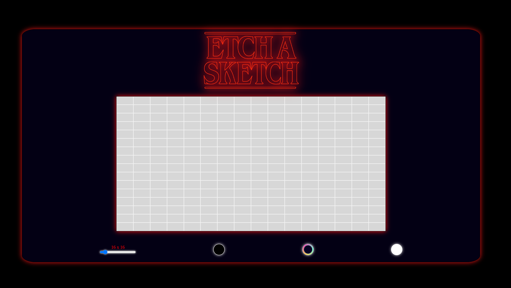

# Etch-a-Sketch

This project is one of the assignments offered by the Odin Project Foundations Course. I had to use my HTML, CSS, and JavaScript skills to create an Etch-a-Sketch game.

The main goals were to learn how to manipulate the DOM and use listeners to modify the page.

